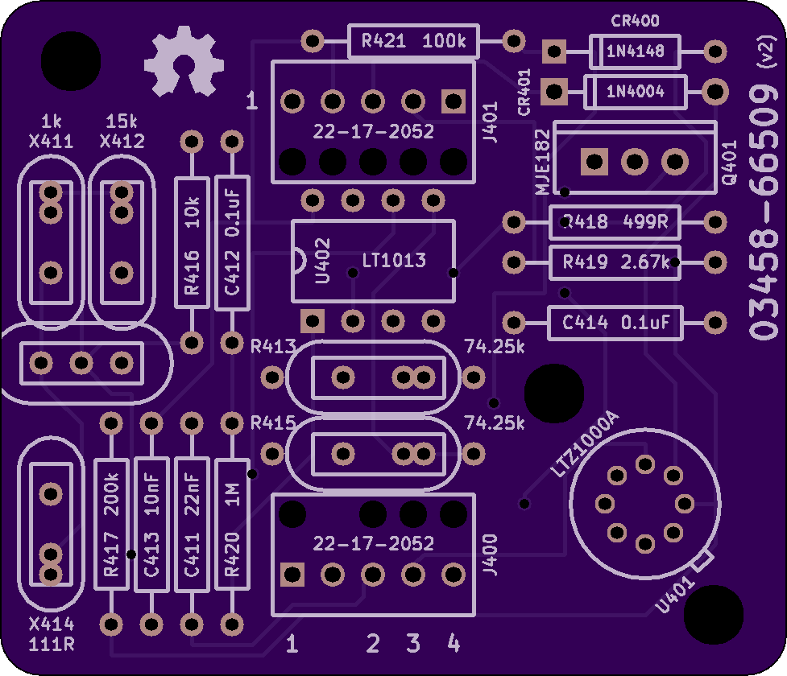
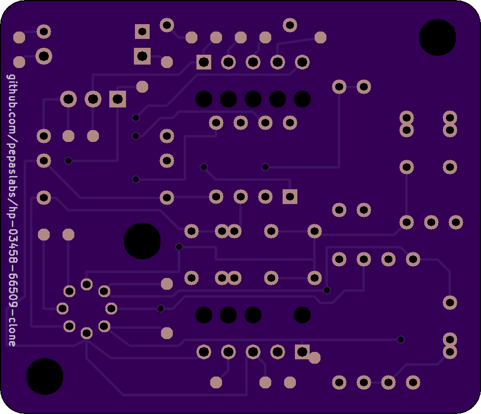
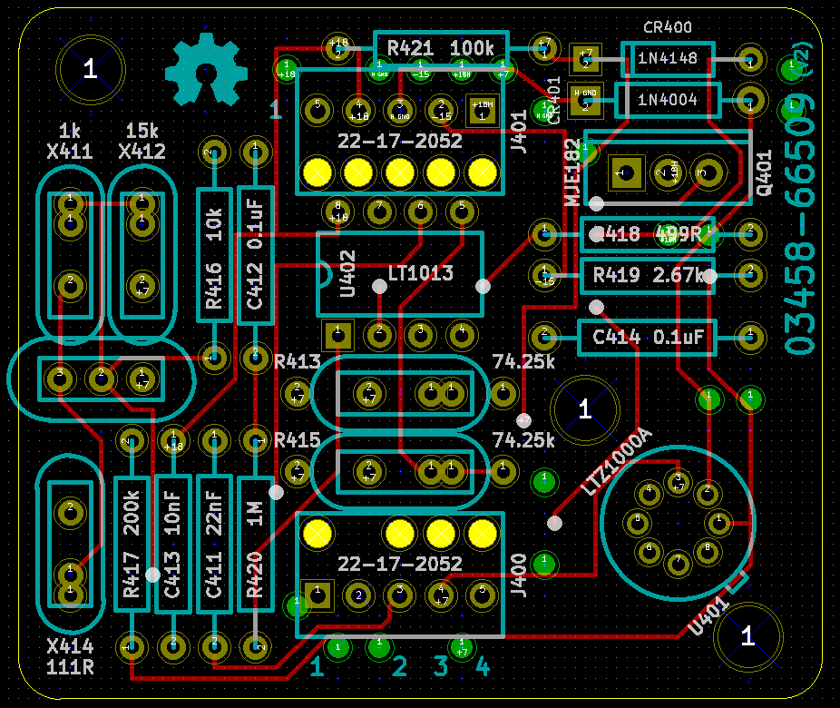
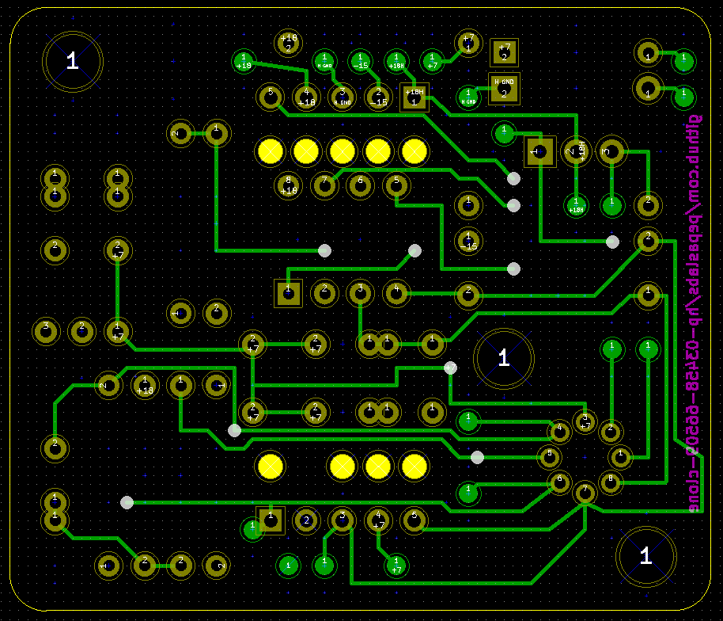
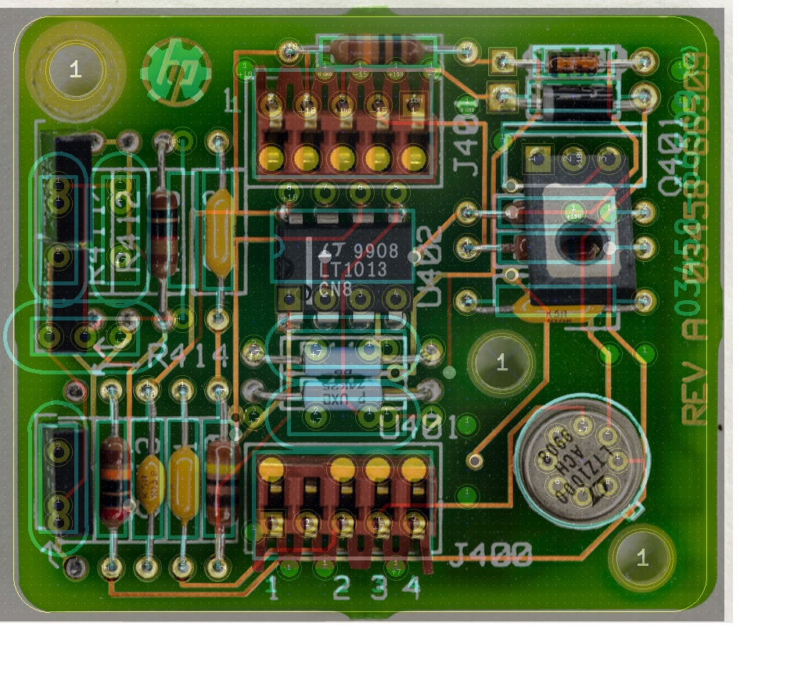
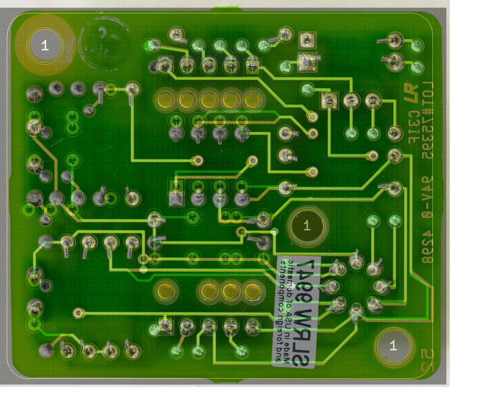

# hp-03458-66509-clone

A clone of the LTZ1000-based A9 reference board (part number 03458-66509) as used in the the HP 3458A 8.5-digit multimeter.

Order a copy of this board from OSHPark: [link](https://oshpark.com/shared_projects/jP5xkfJy)

## Differences between this clone and the official HP board

- R411, R412 and R414 footprints have been removed to allow more room for X411, X412 and X414, which now support Vishay (0.15" lead spacing) foil resistors (including the hermetically sealed variants such as VHP202Z) or AE (0.2" lead spacing) foil resistors.
- An additional footprint which combines X411 and X412 has been added, supporting the Vishay VHD200 voltage dividers.
- This board is slightly shorter than the HP board, and fits within a 50x50mm square (which is the cheapest pricing tier for many PCB manufacturers).

## Alignment

I used photo-editing software to align the traces, components, and holes as closely as possible.

## Thanks

This clone was made possible by the excellent, in-depth articles published by TiN of the EEVBlog forum.  Thanks!
- https://xdevs.com/article/volt_xfer/
- https://xdevs.com/fix/hp3458a/#a9pcba

## Bill of Materials

- Molex 22-17-2052: [link](https://www.mouser.com/ProductDetail/Molex/22-17-2052/?qs=sGAEpiMZZMs%252bGHln7q6pm%252bS0pk2Wo0XxllCQVBT5EJg%3D)
